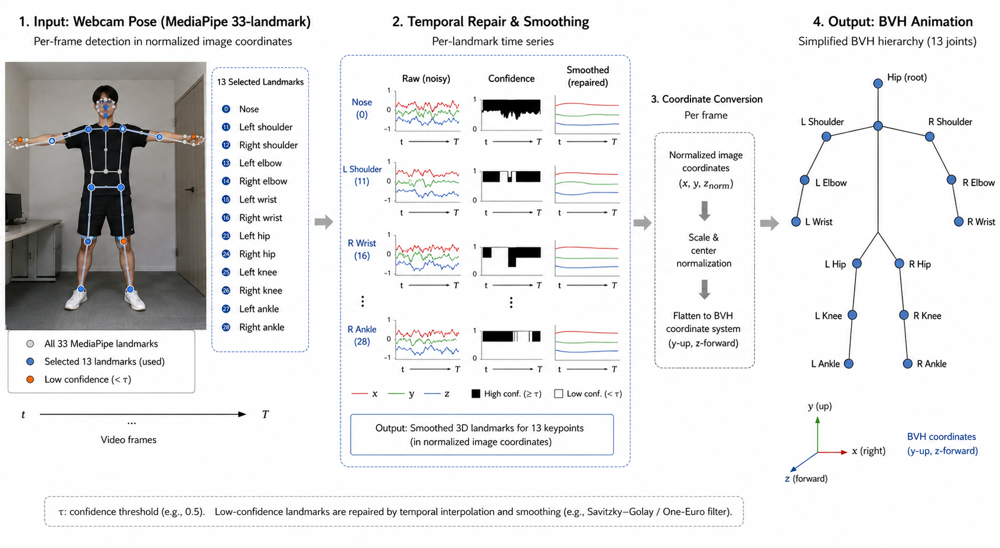
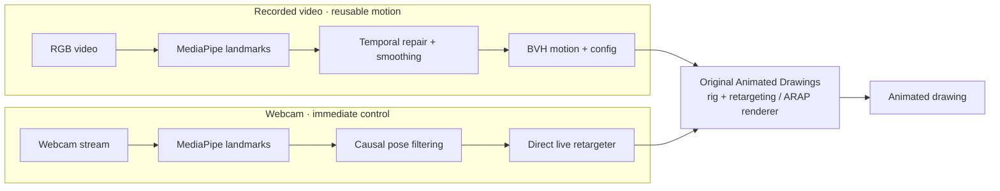
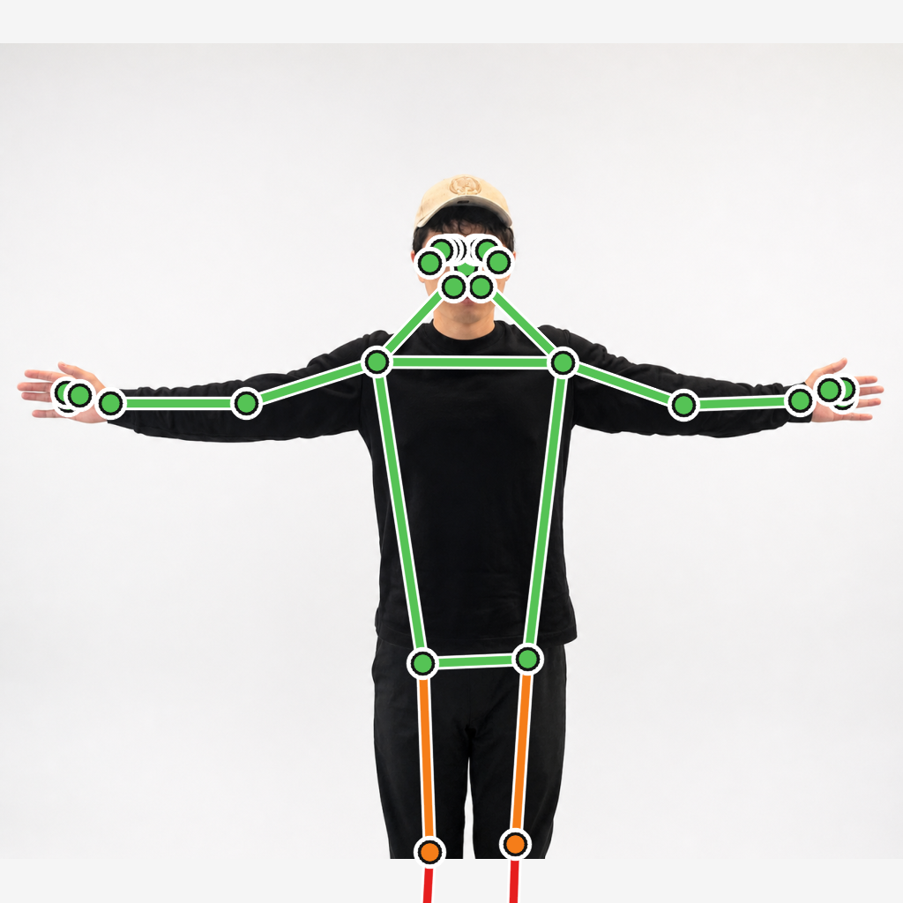
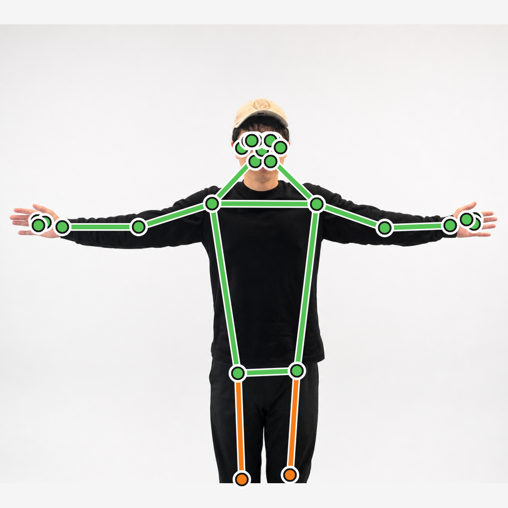

<div align="center">

# 🎨 Watch Me Dance

### Make your drawings move with you.

**Real-time webcam puppeteering and video-driven 2D character animation**  
A computer-vision extension of [Meta AI's Animated Drawings](https://github.com/facebookresearch/AnimatedDrawings)

<p>
  
  
  
  
</p>

**[See what's new](#-what-we-built)** · **[How it works](#-architecture)** · **[Quick start](#-quick-start)** · **[My contributions](#-my-contributions)**

*Brown University · CSCI 1430 Computer Vision · Spring 2026*  
*Project by [Ian Liu](https://github.com/Ianyliu) and [Chen-En Ma](https://github.com/Zion-Ma)*

</div>

---

**From a camera to a cartoon.** [Animated Drawings](https://github.com/facebookresearch/AnimatedDrawings) already rigged and animated hand-drawn characters using prerecorded BVH motion. We extended its motion-input pipeline so you can **upload a short video** to create reusable animation or **move in front of a webcam** to control a drawn character directly.

<table>
<tr>
<td align="center" width="25%"><strong>2</strong><br/><sub>Motion pathways<br/>recorded + live</sub></td>
<td align="center" width="25%"><strong>13 / 33</strong><br/><sub>MediaPipe landmarks<br/>used for retargeting</sub></td>
<td align="center" width="25%"><strong>10 s</strong><br/><sub>Default maximum<br/>recorded clip</sub></td>
<td align="center" width="25%"><strong>63</strong><br/><sub>Automated test functions<br/>across 3 extension suites</sub></td>
</tr>
</table>

> [!NOTE]
> This is an **independent student-project extension of an existing open-source system**. The drawing-detection, segmentation, rigging, and ARAP rendering methods come from Meta's original implementation; our work focuses on **camera-driven motion, retargeting, and interactive applications**. The counts above describe implemented scope, **not benchmarked FPS, speedup, or accuracy**.

## ✨ What We Built

| | Experience | Implementation |
| :---: | --- | --- |
| 🎥 | **Video → animation:** convert recorded RGB video into estimated pose tracks, a pose-overlay preview, reusable BVH motion, and a renderer-compatible motion config. | [Video pipeline](animated_drawings/video_pose/) · [CLI](examples/video_to_motion.py) |
| 🕺 | **Live webcam puppeteering:** move in front of a camera and drive the character directly, with causal pose smoothing, low-confidence tracking safeguards, and side-by-side video/animation display. | [Live retargeting](animated_drawings/video_pose/live.py) · [Dashboard](examples/webcam_to_animation.py) |
| 🖥️ | **Interactive browser workspace:** record/upload video, upload a drawing, choose a character or BVH motion source, preview poses, start rendering, and inspect diagnostic feedback. | [Flask app + frontend](examples/video_app/) |
| 🧪 | **Experimental landmark repair:** explore learned correction of noisy or missing body landmarks using a conditional rectified-flow model, evaluated against deterministic repair. | [Experiment](landmark_flow/) · [Training guide](LANDMARK_FLOW_TRAINING.md) |

<figure>
  
  <figcaption><sub>Our recorded-video motion adapter: pose estimation, temporal repair, conversion to BVH, and reuse of the original drawing renderer.</sub></figcaption>
</figure>

## 🔀 Architecture



The **recorded path** persists reusable motion files; the **live path** drives the animated character without first writing a BVH file or output video. Both are adapters around Meta's existing character system—not new drawing-detection or animation-foundation models.

## 👨‍💻 Contributions

**Ian Liu — motion integration, interactive systems, and engineering.** My work concentrated on making externally estimated human pose usable with a hand-drawn character renderer and making the workflow accessible without manually editing motion files.

| Contribution | What I implemented | Code |
| --- | --- | --- |
| **Pose → character integration** | Adapted MediaPipe/BVH skeleton conventions and motion/retarget configs; connected external motion to character animation and rendering. | [Retarget config](examples/config/retarget/mediapipe_pfp.yaml) · [BVH examples](examples/config/motion/) |
| **Live webcam control** | Built the webcam-to-animation application, direct per-frame pose retargeting, tracking-state guidance, causal smoothing, pose hold/fallback, character selection and root controls. | [Live controller](animated_drawings/video_pose/live.py) · [Webcam UI](examples/webcam_to_animation.py) |
| **Offline and web experience** | Integrated video-to-motion conversion and a Flask/JavaScript interface for recording/uploads, animation previews, rendering workflow, background jobs, and diagnostics. | [Video processing](animated_drawings/video_pose/) · [Web application](examples/video_app/) |
| **Reliability and developer setup** | Updated the Apple Silicon Python/`uv`/TorchServe workflow, handled phone-photo orientation, and wrote or maintained tests for the live, video, and application paths. | [macOS setup](torchserve/setup_macos.sh) · [Live tests](tests/test_live_pose.py) · [Web tests](tests/test_video_app.py) |

**[Chen-En Ma](https://github.com/Zion-Ma) ** investigated pose-estimation alternatives, developed and evaluated the **conditional rectified-flow landmark-correction model**, connected the experiment to the pipeline, and contributed character/report assets and validation. We collaborated on the overall video-to-animation prototype. See the [final project report](final-proj-text/ProjectFinal_ProjectReportTemplate/ProjectFinal_ProjectReportTemplate.tex) and [commit history](https://github.com/Ianyliu/AnimatedDrawings/commits/main) for details.

## 🚀 Quick Start

**Recommended:** Apple Silicon macOS, Python 3.9, and [`uv`](https://docs.astral.sh/uv/). These commands run from the repository root.

```bash
# Install development tools and dependencies
brew install uv ffmpeg
uv python install 3.9
uv venv --python 3.9 .venv
uv pip install -e ".[dev]"

# Check local video app prerequisites
.venv/bin/python examples/video_app.py --check
```

<details open>
<summary><strong>🖥️ Option A — Browser-based animation workspace</strong></summary>

```bash
.venv/bin/python examples/video_app.py --port 5060
```

Visit **http://127.0.0.1:5060** to select a drawing, record/upload video, choose motion, preview, and render.

</details>

<details>
<summary><strong>📷 Option B — Drive a drawing with your webcam</strong></summary>

```bash
.venv/bin/python examples/webcam_to_animation.py --camera 0
```

A desktop window displays camera landmarks alongside the driven character. Try **Space** to pause, **R** to reset, **[ / ]** to switch bundled characters, and **U** to upload a drawing. Use `--list-figures` to view available character rigs without starting your camera.

</details>

<details>
<summary><strong>🎞️ Option C — Convert a video to BVH motion</strong></summary>

```bash
.venv/bin/python examples/video_to_motion.py input.mp4 ./video_motion_out --max-seconds 10
```

The converter writes:

```text
video_motion_out/
├── pose_sequence.json  # estimated body landmarks
├── pose_overlay.mp4    # video with pose visualization
├── motion.bvh          # reusable skeleton animation
└── motion.yaml         # original renderer motion config
```

</details>

**When is TorchServe needed?** Bundled characters (or a previously generated `char_cfg.yaml`) can be used for live control without it. **A new, unrigged drawing** needs the original TorchServe drawing-analysis pipeline. Follow the [macOS setup and custom drawing instructions](LEGACY_GUIDE.md#animating-your-own-drawing) if you need that step.

## 🧪 Diagnostics and Validation

The extension includes **63 test functions** in these three focused suites:

```bash
.venv/bin/python -m pytest \
  tests/test_video_pose.py \
  tests/test_video_app.py \
  tests/test_live_pose.py
```

They cover BVH conversion and motion compatibility, unreliable video/pose handling, web session and upload protections, live retargeting and pose fallback, among other behaviors. **63 is the number of defined test functions, not a claimed CI pass count or coverage percentage.**

<details>
<summary><strong>Pose diagnostic examples</strong></summary>

<table>
<tr>
<td align="center"><strong>Raw tracking overlay</strong></td>
<td align="center"><strong>Smoothed tracking overlay</strong></td>
</tr>
<tr>
<td></td>
<td></td>
</tr>
</table>

These are illustrative pose-processing visualizations, **not quantitative accuracy or latency comparisons**.

</details>

## 🔬 Research Notes and Limitations

- **Monocular geometry:** MediaPipe landmarks do not provide calibrated, metric 3D motion; front-facing gestures work better than complex depth rotations, occlusions, and partially visible bodies.
- **Recorded clips:** default input limit is **10 seconds**. The live path processes incoming frames causally rather than generating an offline BVH.
- **Pose correction:** deterministic interpolation, smoothing, and tracking rules are the default. We trained an optional rectified-flow corrector, but its evaluation **did not justify replacing the simpler baseline** on the primary masked L1/PCK criteria. The learned option remains experimental ([report](final-proj-text/ProjectFinal_ProjectReportTemplate/ProjectFinal_ProjectReportTemplate.tex)).
- **Prototype, not a hosted product:** the web interface runs locally; camera permissions, lighting, full-body visibility, compatible rigs, and local compute affect the experience. Treat recorded video and landmark traces as potentially sensitive data.

## 📚 Origin, Documentation, and License

This repository is a **fork of [facebookresearch/AnimatedDrawings](https://github.com/facebookresearch/AnimatedDrawings)**, based on:

> Smith, H. J., Zheng, Q., Li, Y., Jain, S., & Hodgins, J. K. (2023). [*A Method for Animating Children's Drawings of the Human Figure*](https://doi.org/10.1145/3592788). *ACM Transactions on Graphics*, 42(3).

Meta developed the original drawing detector/segmenter, automatic rigging, ARAP deformation/graphics engine, example motions, and publicly released models/datasets. **Those are not claimed as contributions of this project.** Meta's original README animation and browser demo are also **upstream examples**, not footage of our webcam extension.

- **[Extended / original usage guide](LEGACY_GUIDE.md)** — legacy drawing-animation tutorials, TorchServe setup, export examples, links to upstream models/data, and paper citation
- **[Project report](final-proj-text/ProjectFinal_ProjectReportTemplate/ProjectFinal_ProjectReportTemplate.tex)** — motivation, methods, experiments, tradeoffs, and individual roles
- **[Model experiment notes](LANDMARK_FLOW_TRAINING.md)** — optional learned landmark-correction workflow
- **[License](LICENSE)** — MIT license for the code; consult the upstream documentation for dataset-specific terms

<div align="center">
<sub>Built on Meta's Animated Drawings · Extended for recorded and real-time human motion · 2026</sub>
</div>
